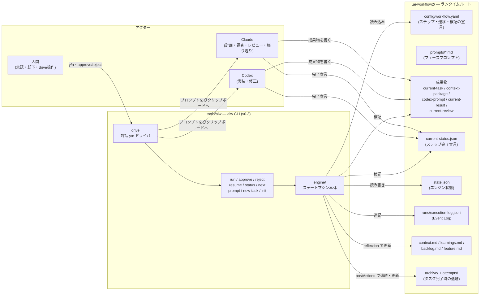
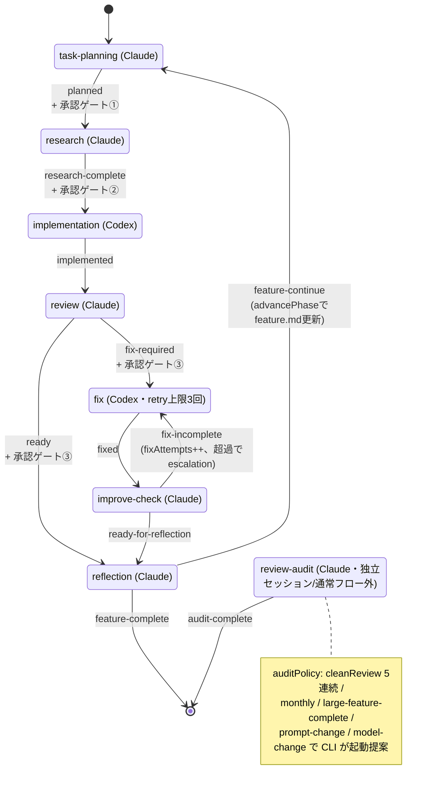
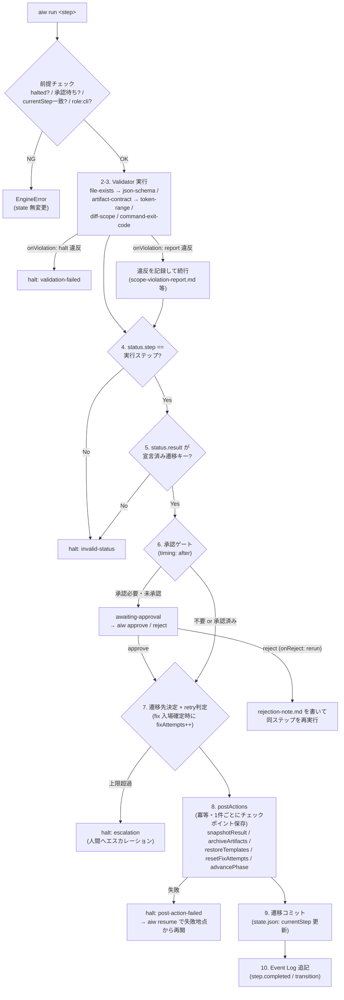
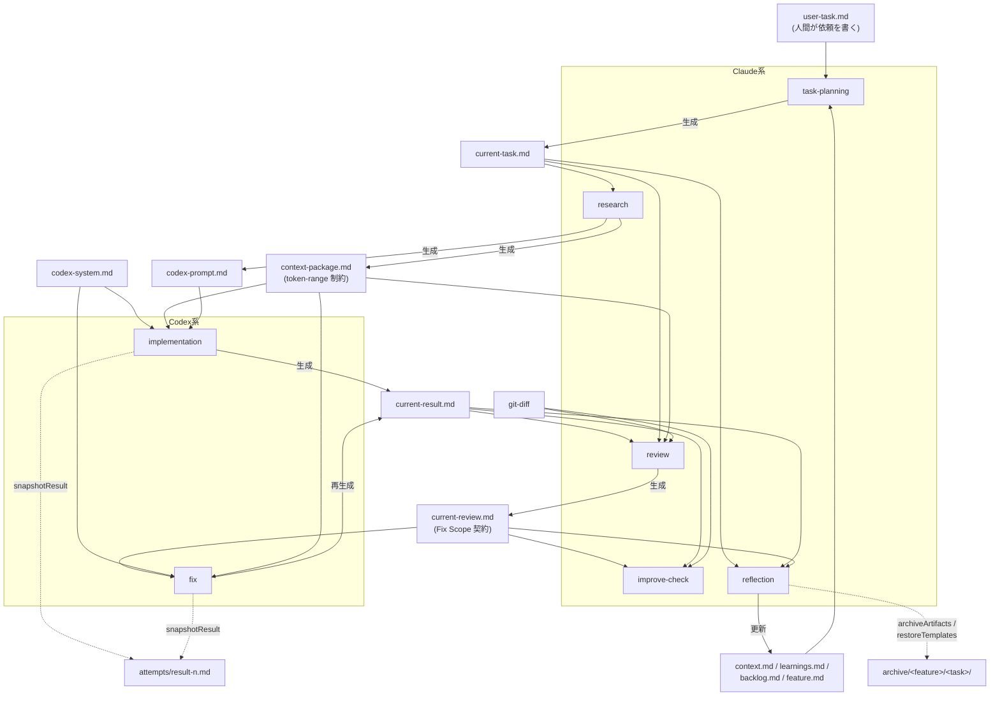

# ai-workflow2 アーキテクチャ

`.ai-workflow2/` は、設計 rev.5 に基づく **設定駆動 AI ワークフローエンジンのランタイムルート**。
エンジン本体は [tools/aiw](../tools/aiw)(TypeScript / Node 20)で、`aiw` CLI として動作する。

> 基本思想: **エンジンは作業を代行しない**。Claude / Codex が成果物 + `current-status.json` を作り、
> `aiw run <step>` は「検証 → 承認 → 遷移確定 → postActions → state 更新 → ログ」だけを行う司会・検証役。

---

## 1. 全体像(コンポーネント図)



- CLI は AI API を呼ばない。プロンプトをクリップボードに出し、**人間が Claude / Codex に貼る**。
- `singleActiveFeature: true` — `current-*.md` がフラット構造のため並行 feature は不可(意図的制約)。

---

## 2. ワークフロー・ステートマシン(workflow.yaml v5)

承認ゲートは 3 箇所(①task-planning後 / ②research後 / ③review後)。
Fix ループは `fixAttempts` で有界化(初回 + maxRetries=2 の計 3 回、超過で escalation halt)。



各遷移は `current-status.json` の `result` 値で駆動される。宣言外の値・step 不一致は
`invalid-status` で halt(直前ステップの宣言のままの場合だけは平易なエラーで再実行を案内)。

---

## 3. 完了処理パイプライン(§7.7 — `aiw run <step>`)

`engine/completion.ts` の `processCompletion` が実装。ステップ 2 から再入可能(Resumability)。



`aiw resume` の 3 分岐:

| 状態 | 挙動 |
| --- | --- |
| `pendingTransition` あり | postActions を未完了分から続行 → コミット(2–7 は再実行しない) |
| `halted` | halt を解除し、現在ステップをステップ 2 から再検証 |
| クリーン中断 | `current-status.json` が現在ステップと一致すればステップ 2 から再実行 |

---

## 4. 成果物データフロー(誰が何を読み書きするか)



- 全ステップが加えて `current-status.json` を出力(遷移の駆動源)。
- `diff-scope` バリデータが宣言ファイル(context-package / Fix Scope)外の変更を検出。
  implementation では `report`(レビューに添付)、fix では `halt`(Bounded Fixes)。

---

## 5. ディレクトリレイアウト

```text
.ai-workflow2/                      # ランタイムルート(§12)
├── config/
│   ├── workflow.yaml               # ステップ・遷移・validator・approval の宣言(version: 5)
│   └── model-policy.json           # フェーズ別の推奨モデル・effort
├── schemas/current-status.schema.json
├── prompts/                        # ステップ別フェーズプロンプト(aiw prompt でコピー)
│   ├── task-planning.md / research.md / review.md
│   ├── implementation.md / fix.md  # Codex 用
│   └── improve-check.md / reflection.md / review-audit.md
├── templates/                      # current-* の初期テンプレ(new-task / restoreTemplates で復元)
├── user-task.md                    # 人間の依頼(入口)
├── current-task.md                 # ┐
├── context-package.md              # │
├── codex-prompt.md                 # ├ ワーキング成果物(タスクごとに作り直す)
├── current-result.md               # │
├── current-review.md               # ┘
├── current-status.json             # ステップ完了宣言 { step, result, ... }
├── state.json                      # エンジン状態(currentStep / status / fixAttempts / pending*)
├── context.md / learnings.md / backlog.md / feature.md   # タスク横断ナレッジ
├── codex-system.md                 # Codex 共通システム指示
├── attempts/result-<n>.md          # implementation / fix ごとのスナップショット
├── archive/<feature>/<task>/       # reflection 完了時の成果物退避
├── runs/execution-log.jsonl        # Event Log(バージョン情報付き)
└── research/                       # 調査メモ置き場

tools/aiw/                          # エンジン実装(Node 20 / Volta pin / esbuild)
├── src/cli.ts                      # commander CLI + drive / shell(REPL)
├── src/engine/
│   ├── engine.ts                   # 公開API: initRoot / runStep / approve / reject / resume
│   ├── completion.ts               # §7.7 パイプライン(processCompletion / resume)
│   ├── loader.ts                   # workflow.yaml ローダー
│   ├── validators.ts               # file-exists / json-schema / artifact-contract / token-range / diff-scope
│   ├── postActions.ts              # snapshotResult / archiveArtifacts / restoreTemplates / advancePhase 等
│   ├── retry.ts                    # fixAttempts 有界化(§7.6)
│   ├── state.ts / status.ts        # state.json / current-status.json の読み書き
│   ├── eventLog.ts / versions.ts   # Event Log + バージョン記録
│   └── paths.ts / types.ts / artifactContract.ts / tokens.ts
├── src/{heartbeat,prompt,files,policy,state}.ts   # レガシー(.ai-workflow/ 用 v0.2)ヘルパー
└── assets/                         # init 時に複製される config / schemas / prompts / templates / seeds
```

---

## 6. 横断的な仕組み

| 仕組み | 内容 |
| --- | --- |
| **Artifact Contract** | workflow.yaml の `artifacts:` に必須 Markdown セクション / JSON Schema を宣言し、validator が構造を強制 |
| **バージョン分離 (rev.3)** | workflow / prompts / templates / schemas が個別バージョンを持ち、Event Log に使用バージョンを記録 |
| **Bounded Fixes (§7.6)** | fix 入場確定時に `fixAttempts++`。初回+2 リトライで上限、超過は `escalation` halt(既定は human へ) |
| **Resumability** | postActions は 1 件完了ごとに `pendingTransition` へチェックポイント保存。`aiw resume` が冪等に再開 |
| **監査 (review-audit)** | 通常フロー外・fresh セッション必須。cleanReview 5 連続などで CLI が起動提案(カウンタは CLI 所有) |
| **verify-local (M1.5)** | テストの検証は独立ステップではなく validator が担う。implementation / fix で typecheck を実行し、失敗は `report` → `test-report.md` → review → `fix-required` → 既存の fix ループ（`fixAttempts` で有界）。走査ファイル数と「検査していない範囲」を毎回出力する |

## 7. 現在の状態(2026-07-28 時点)

`state.json`: `currentStep: implementation` / `status: ready` / `lastCompletedStep: research`。
つまり承認ゲート②通過済みで、**Codex による実装フェーズの途中**(成果物 `current-result.md` +
`current-status.json`(`implemented`) を作成後、`aiw run implementation` で review へ進む)。
